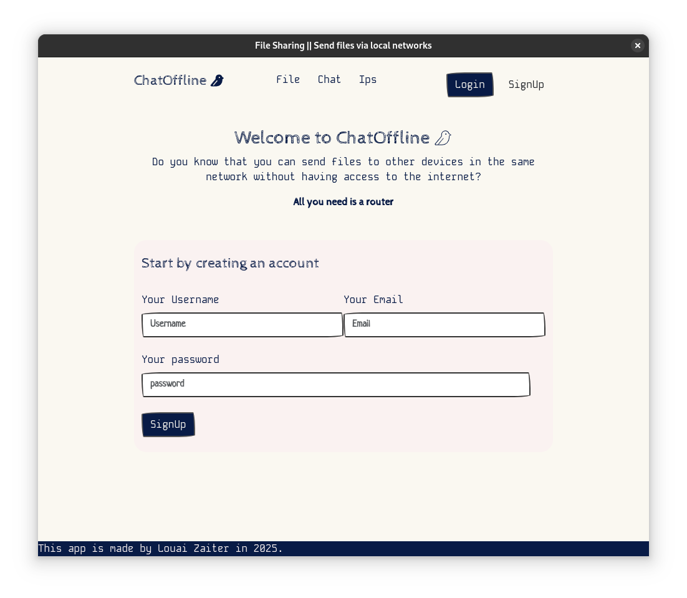
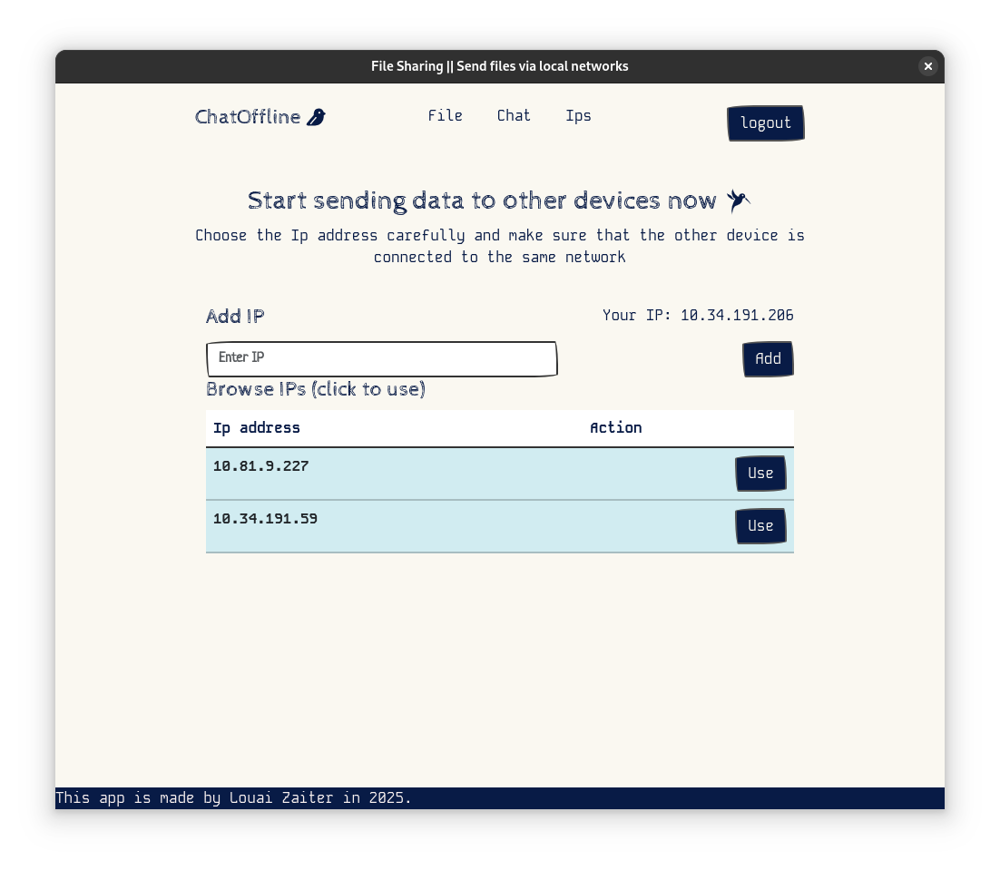
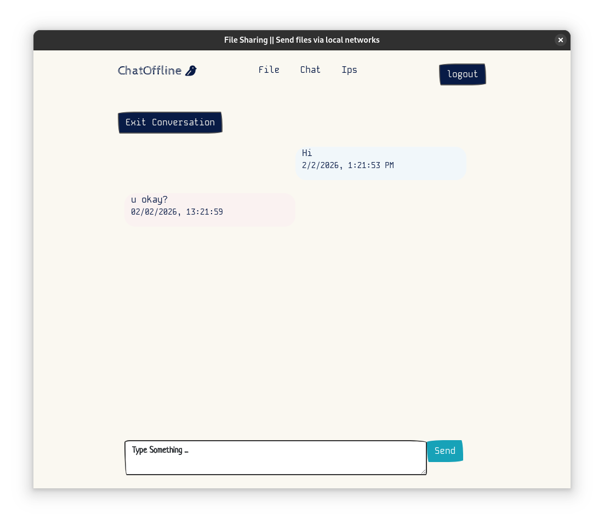
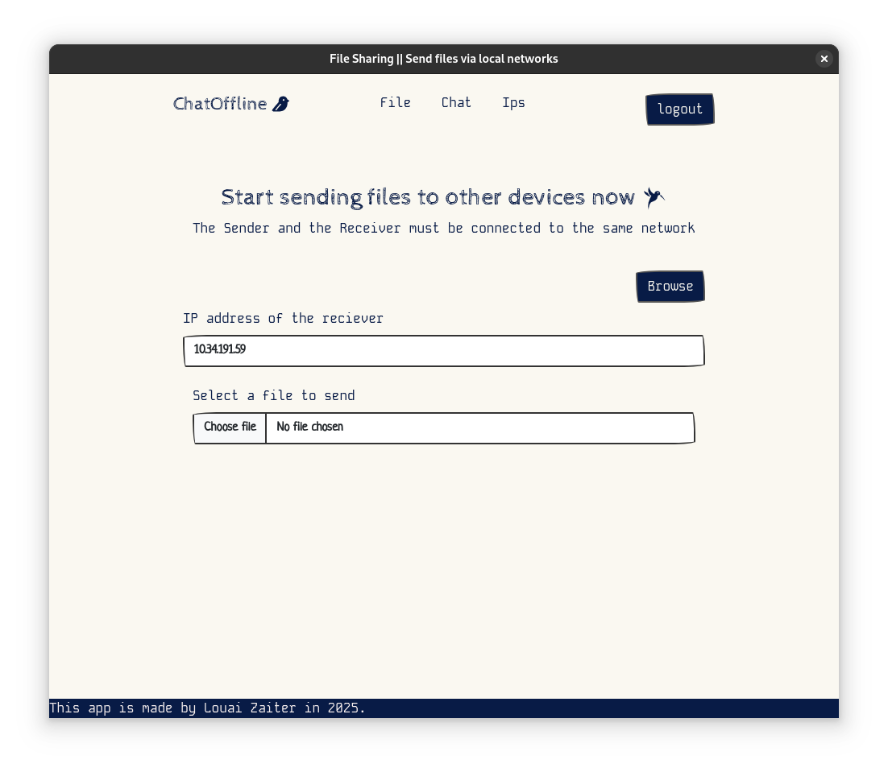
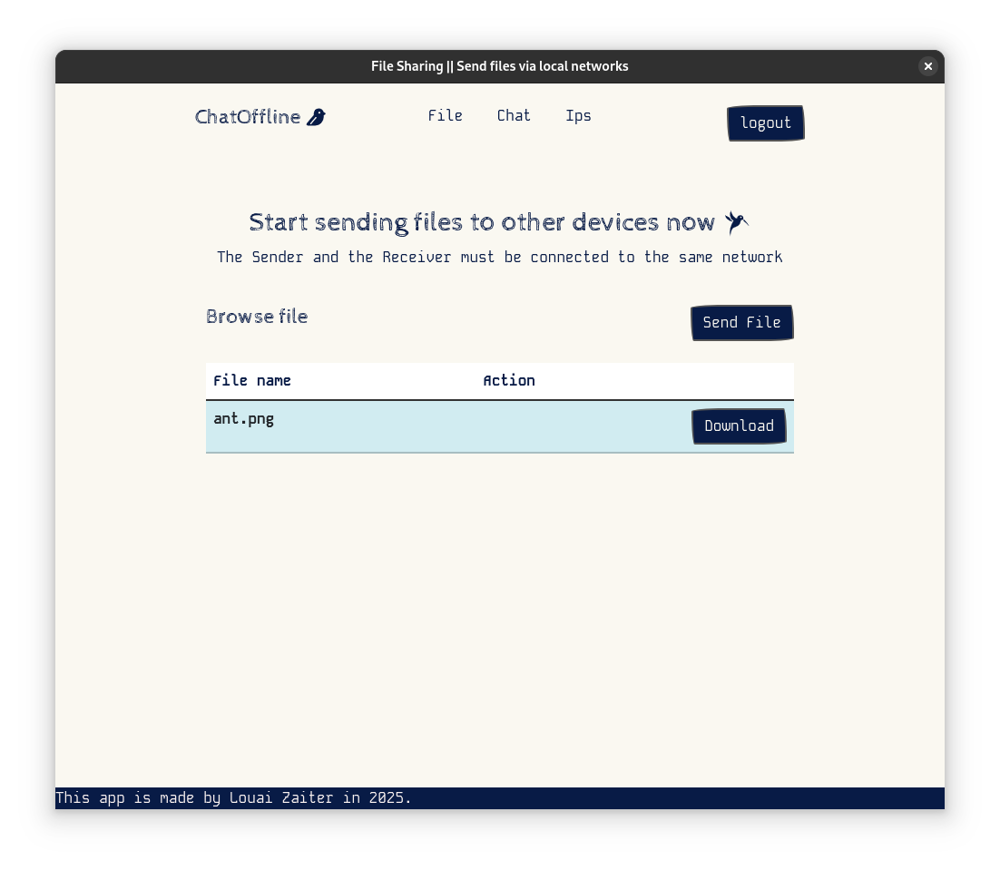

### Chatoffline


A desktop application for offline file-sharing and messaging built using Electron JS
1. The login screen

2. The signup screen

3. Browse ip screen

4. Chat screen

5. File sharing screen

6. Download screen


#### Technologies used:
- ElectronJS
- ElectronDB
- React

#### Install dpendencies
```
npm install
```
#### Run the software locally
```
npm run dev
```
#### build for linux
```
npm run build:linux
```
#### build for windows
```
npm run build:win
```
#### build for mac os
```
npm run build:mac
```

- After building the app, navigate to the dist folder and you'll find an executable

All rights reserved, Louai Zaiter, 2026

This code is shared under the MIT License